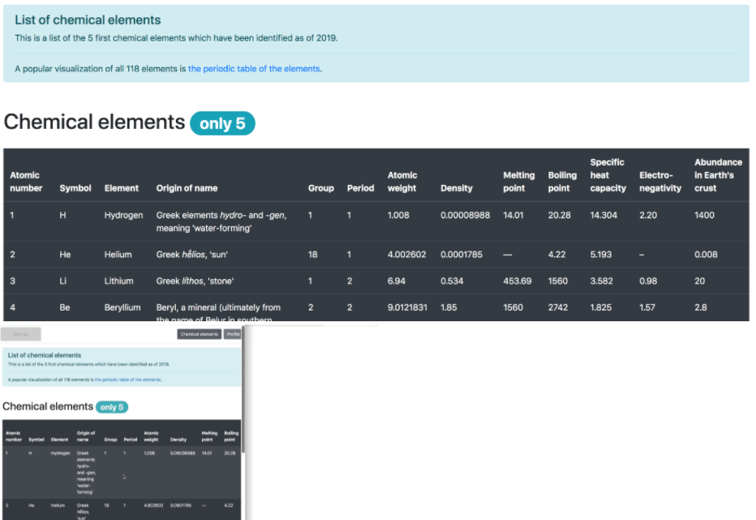
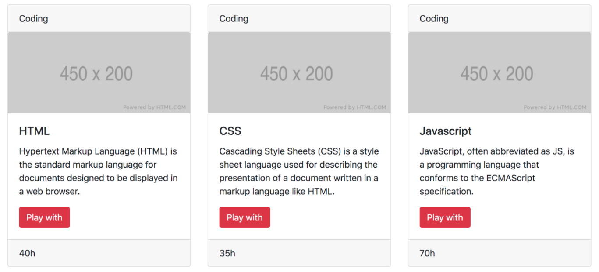
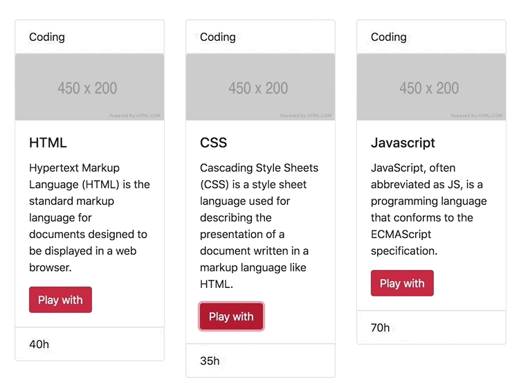

# 0x0A. Bootstrap

Bootstrap is a free and open-source CSS framework directed at responsive, mobile-first front-end web development. It contains CSS and JavaScript design templates for typography, forms, buttons, navigation, and other interface components.

For this project, I will use Bootstrap 4.4 and only the CSS styling part.

## Resources

https://getbootstrap.com/docs/4.4/getting-started/introduction/

## Learning Objectives

To know the:

- Usage of Containers
- Usage of the Grid system
- Usage of Components
- Usage of Utilities

## Contributing
Pull requests are welcome. For major changes, please open an issue first to discuss what you would like to change.

## Tasks

### 0. Reboot styling:
Add Bootstrap to reset the CSS styling.

### 1. Blocks:
Build this responsive web page:.

### 2. Table of chemical elements:
Build this responsive web page:

### 3. Cards:
Build this responsive web page:

### 4. Bob Dylan:
Build a responsive design.

### 5. Show/Hide - screen size:
Build a responsive design.

### 6. Overwrite CSS:
Create the custom stylesheet 6-styles.css

## Authors

- [@Julianeme](https://github.com/Julianeme)